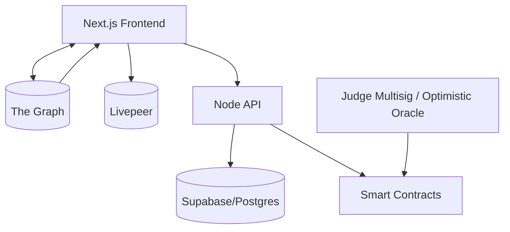

# LiveStakes 🎥💰

*Real-time prediction markets for hackathon projects*

---

### 👤 Created by Molly Beach, Ziz Khu, and Joao Santos

---

## 1. Overview 🔍

LiveStakes is an open source platform that lets viewers watch every ETHGlobal hackathon project in real time and place on-chain predictions on which ones will win prizes. Teams broadcast short demo clips through Livepeer while the protocol prices each project via an automated market maker. When official judges announce winners, the contracts settle and payout bettors instantly.

This repository is a **monorepo** managed by Turborepo. It contains the Next.js frontend, Solidity smart contracts, Graph subgraph, and infrastructure as code required to deploy the complete system.

---

## 2. Feature Highlights ✨

* 🎥 Live project video grid powered by Livepeer and IPFS storage
* 📈 Prediction markets per project using UMA Long–Short Pair templates
* 💹 Dynamic odds and trading with CPMM pricing
* 🔁 Re-allocation of positions before judging closes
* 🧑‍⚖️ Judge settlement oracle enforced by a multisig and Optimistic Oracle
* 🔐 SIWE authentication for bettors and GitHub OAuth onboarding for teams
* 📊 Real-time stats (bet volume, price movement, project commits) via The Graph and Supabase

---

## 3. Tech Stack 🛠️

| Layer               | Technology                                                |
| ------------------- | --------------------------------------------------------- |
| 💻 Frontend         | Next.js 14, React 18, TailwindCSS, shadcn/ui, wagmi, viem |
| 📜 Smart contracts  | Solidity 0.8.x, Foundry, OpenZeppelin, UMA LSP            |
| 📡 Indexing         | The Graph, GraphQL Codegen                                |
| 🗂️ Storage & Media | Livepeer, IPFS (nft.storage)                              |
| 🌐 Off-chain API    | Node 18 (Fastify), Supabase/PostgreSQL                    |
| 🔐 Auth             | Sign-In With Ethereum, GitHub OAuth                       |
| 🚀 DevOps           | Turborepo, GitHub Actions, Vercel, Alchemy, Tenderly      |

---

## 4. Architecture 🧠



---

## 5. Repository Directory Structure 📁

```
livestakes/
├─ apps/
│  └─ web/                 # Next.js frontend (App Router)
├─ packages/
│  ├─ contracts/           # Solidity source, tests, deployments
│  ├─ subgraph/            # Graph protocol manifest and mappings
│  └─ ui/                  # Shared React component library (shadcn/ui wrappers)
├─ infra/
│  ├─ terraform/           # Vercel, Supabase, Livepeer resources
│  └─ gh-actions/          # Reusable workflow templates
├─ scripts/                # Helper scripts (deploy, seed, data-export)
├─ docs/                   # Additional specs, diagrams, decision logs
├─ .github/
│  └─ workflows/           # CI pipelines: lint, test, contract size, graph build
├─ turbo.json              # Turborepo pipeline config
├─ foundry.toml            # Foundry toolchain settings
└─ README.md               # You are here
```

### Directory Details 📦

| Path                   | Purpose                                                                                                              |
| ---------------------- | -------------------------------------------------------------------------------------------------------------------- |
| **apps/web**           | 🌐 Public site and dashboard. Contains pages, components, hooks, and api routes.                                     |
| **packages/contracts** | 🔏 Solidity contracts, Foundry tests, deployment scripts, and ABI generation via Forge.                              |
| **packages/subgraph**  | 🧬 Subgraph schema, mappings, and AssemblyScript tests for indexing on-chain events.                                 |
| **packages/ui**        | 🎨 Design-system primitives wrapped around shadcn/ui for consistent styling.                                         |
| **infra/terraform**    | 🏗️ Infrastructure definitions for Vercel projects, Supabase database, Livepeer API keys, and Alchemy RPC endpoints. |
| **scripts**            | ⚙️ Type-scripted CLI utilities for project onboarding, market creation, and database seeding.                        |

---

## 6. Getting Started 🚀

### 6.1 Prerequisites ✅

* Node ≥ 18
* pnpm ≥ 9
* Foundry (`curl -L https://foundry.paradigm.xyz | bash`)
* Docker (for Graph and Postgres)

### 6.2 Installation 💾

```bash
# clone
$ git clone https://github.com/your-org/livestakes.git && cd livestakes

# install workspace deps
$ pnpm install

# copy env templates
$ cp apps/web/.env.example apps/web/.env.local
$ cp packages/contracts/.env.example packages/contracts/.env
```

### 6.3 Start All Services 🔧

```bash
# spin up local Postgres and Graph Node
$ pnpm dev:infra   # uses Docker compose

# run contracts on anvil
$ pnpm dev:chain   # foundry anvil --fork-url $SEPOLIA_RPC

# deploy core markets
$ pnpm dev:deploy

# run frontend & api
$ pnpm dev:web     # turborepo triggers both apps/web and node api
```

Navigate to `http://localhost:3000` to see LiveStakes in action.

---

## 7. Deployment 🚢

* **Frontend** — pushed to `main` automatically deploys to Vercel preview. `production` branch triggers production promotion.
* **Contracts** — tagged releases run `forge script Deploy --broadcast` against Sepolia, then Mainnet on manual approval.
* **Subgraph** — CI publishes to TheGraph hosted service.

---

## 8. Testing 🧪

* **Unit** — `forge test` for contracts, `vitest` for TypeScript.
* **Integration** — GraphQL queries against a forked chain.
* **End-to-end** — Playwright scripts simulating a bettor flow.

Run all tests:

```bash
$ pnpm test
```

---

## 9. Contributing 🤝

1. Create a feature branch
2. Commit using Conventional Commits (`feat(ui): add project card`)
3. Open a PR; templates auto-label scope
4. CI must pass lint, tests, and contract size

---

## 10. License 📄

MIT © 2025 LiveStakes Contributors
