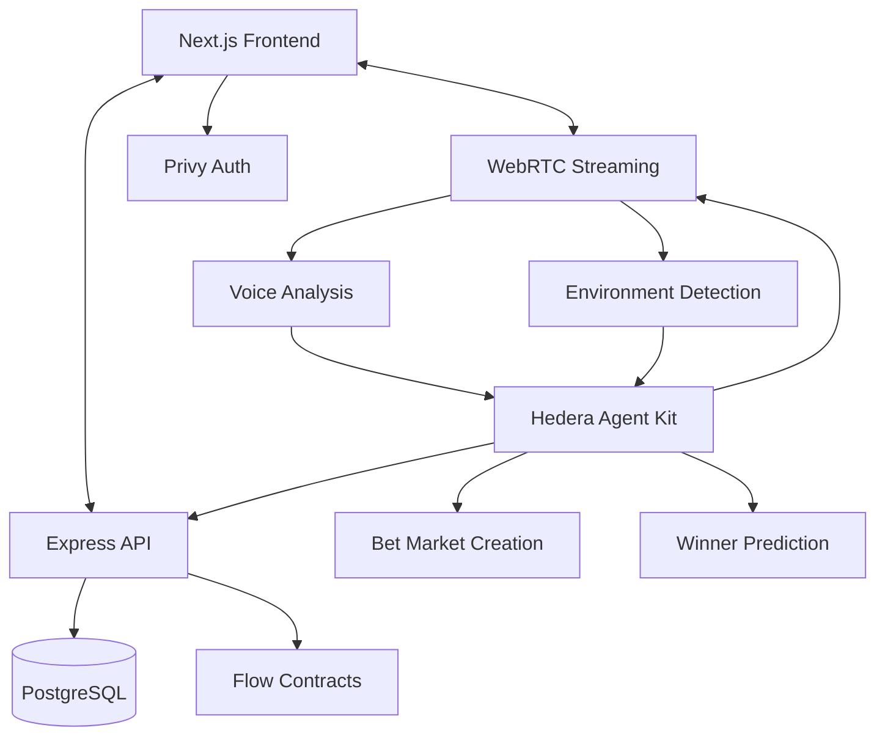

# LiveStakes 🎥💰

*Real-time prediction markets for hackathon projects*

---

### 👤 Created by Molly Beach, Ziz Khu, and Joao Santos

---

## 1. Overview 🔍

LiveStakes is an open source platform that lets viewers watch every ETHGlobal hackathon project in real time and place on-chain predictions on which ones will win prizes. Teams broadcast live demos through WebRTC while the Hedera Agent Kit analyzes livestream environment and voice data to automatically create betting markets and predict winners using an automated market maker. When the AI makes final decisions, the Flow blockchain contracts settle and payout bettors instantly.

This repository is a **monorepo** managed by Turborepo. It contains the Next.js frontend, Flow Cadence smart contracts, Hedera Agent Kit integration, WebRTC streaming server, and infrastructure as code required to deploy the complete system.

---

## 2. Feature Highlights ✨

* 🎥 Live project video streaming powered by WebRTC and Express server
* 🤖 AI-powered betting market creation using Hedera Agent Kit analysis
* 🎙️ Voice and environment data processing for automated winner prediction
* 📈 Dynamic prediction markets with CPMM pricing on Flow blockchain
* 💹 Real-time odds adjustment based on AI insights
* 🔁 Re-allocation of positions before AI makes final decisions
* 🔐 Privy wallet authentication for seamless Web3 onboarding
* 📊 Real-time stats (bet volume, price movement, AI confidence scores) via PostgreSQL

---

## 3. Tech Stack 🛠️

| Layer               | Technology                                                |
| ------------------- | --------------------------------------------------------- |
| 💻 Frontend         | Next.js 14, React 18, TailwindCSS, shadcn/ui, Flow Client Library |
| 📜 Smart contracts  | Cadence (Flow), Flow CLI, Flow Emulator                   |
| 🤖 AI Decision Engine | Hedera Agent Kit, Voice Analysis, Environment Processing  |
| 🎥 Live Streaming   | WebRTC, Express.js, Socket.io                            |
| 🗂️ Database         | PostgreSQL, Prisma ORM                                   |
| 🌐 Off-chain API    | Node 18 (Express), WebRTC signaling server               |
| 🔐 Auth             | Privy (Wallet Connection), GitHub OAuth                  |
| 🚀 DevOps           | Turborepo, GitHub Actions, Vercel, Flow Testnet          |

---

## 4. Architecture 🧠



---

## 5. Repository Directory Structure 📁

```
livestakes/
├─ apps/
│  ├─ web/                 # Next.js frontend (App Router)
│  └─ streaming-server/    # Express WebRTC signaling server
├─ packages/
│  ├─ contracts/           # Flow Cadence contracts and tests
│  ├─ hedera-agent/        # Hedera Agent Kit integration and AI logic
│  └─ ui/                  # Shared React component library (shadcn/ui wrappers)
├─ infra/
│  ├─ terraform/           # Vercel, PostgreSQL, Flow network resources
│  └─ gh-actions/          # Reusable workflow templates
├─ scripts/                # Helper scripts (deploy, seed, data-export)
├─ docs/                   # Additional specs, diagrams, decision logs
├─ .github/
│  └─ workflows/           # CI pipelines: lint, test, contract size, AI model validation
├─ turbo.json              # Turborepo pipeline config
├─ flow.json               # Flow network configuration
└─ README.md               # You are here
```

### Directory Details 📦

| Path                      | Purpose                                                                                                              |
| ------------------------- | -------------------------------------------------------------------------------------------------------------------- |
| **apps/web**              | 🌐 Public site and dashboard. Contains pages, components, hooks, and Flow blockchain integration.                    |
| **apps/streaming-server** | 📡 Express server handling WebRTC signaling, Socket.io connections, and livestream management.                       |
| **packages/contracts**    | 🔏 Flow Cadence smart contracts, Flow CLI tests, and deployment scripts for prediction markets.                      |
| **packages/hedera-agent** | 🤖 Hedera Agent Kit integration for AI analysis, voice processing, and automated betting decisions.                   |
| **packages/ui**           | 🎨 Design-system primitives wrapped around shadcn/ui for consistent styling.                                         |
| **infra/terraform**       | 🏗️ Infrastructure definitions for Vercel projects, PostgreSQL database, and Flow network endpoints.                  |
| **scripts**               | ⚙️ Type-scripted CLI utilities for project onboarding, market creation, and database seeding.                        |

---

## 6. Getting Started 🚀

### 6.1 Prerequisites ✅

* Node ≥ 18
* pnpm ≥ 9
* Flow CLI
* Docker (for PostgreSQL)
* PostgreSQL ≥ 14

### 6.2 Installation 💾

Standard installation process for Node.js monorepo with workspace dependencies, environment configuration, and Flow blockchain setup.

### 6.3 Start All Services 🔧

Development environment includes PostgreSQL database, Flow emulator, Hedera Agent Kit AI service, WebRTC streaming server, and Next.js frontend all running concurrently through Turborepo.

Navigate to `http://localhost:3000` to see LiveStakes in action.

---

## 7. Deployment 🚢

* **Frontend** — pushed to `main` automatically deploys to Vercel preview. `production` branch triggers production promotion.
* **Streaming Server** — deployed to Vercel as serverless functions with WebRTC support.
* **Contracts** — tagged releases deploy against Flow Testnet, then Mainnet on manual approval.
* **Hedera Agent** — AI service deployed to cloud infrastructure with voice processing capabilities.

---

## 8. Testing 🧪

* **Unit** — Flow testing for Cadence contracts, Vitest for TypeScript.
* **Integration** — WebRTC streaming tests and AI prediction accuracy validation.
* **End-to-end** — Playwright scripts simulating complete bettor and streaming flow.

Comprehensive testing suite covers all components from smart contracts to AI models.

---

## 9. Contributing 🤝

1. Create a feature branch
2. Commit using Conventional Commits (`feat(ui): add project card`)
3. Open a PR; templates auto-label scope
4. CI must pass lint, tests, and contract size

---

## 10. License 📄

MIT © 2025 LiveStakes Contributors
